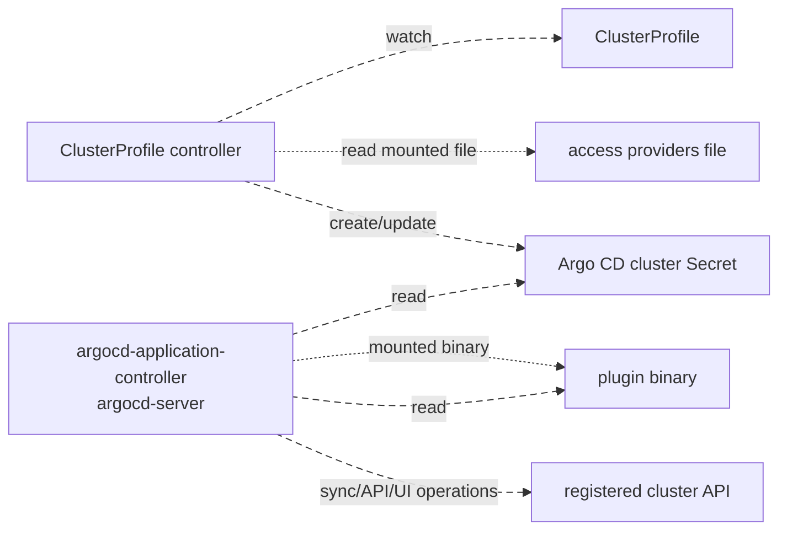
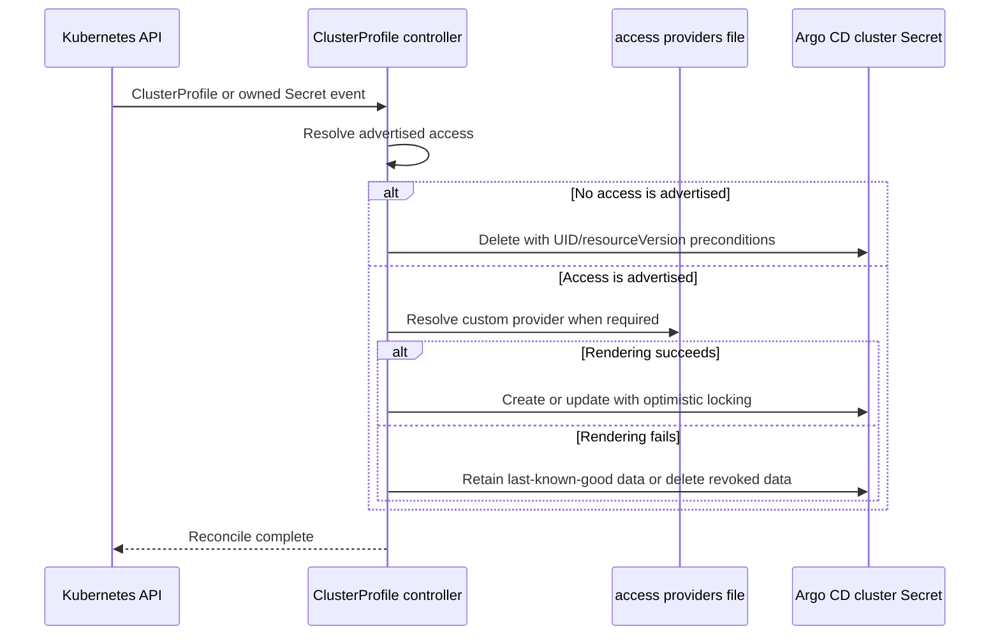
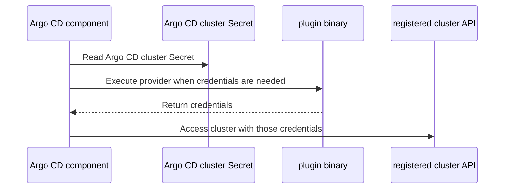

# Architecture

This project makes clusters represented by Cluster Inventory API
`ClusterProfile` resources available to Argo CD as managed clusters.

It does this by translating ClusterProfile resources into Argo CD cluster
Secrets. The ClusterProfile controller writes each Secret into the namespace of
its source ClusterProfile and does not authenticate to registered clusters.
Argo CD components use the translated Secrets when accessing those clusters and
may execute configured provider plugins to obtain credentials.

## Component Model



The access providers file and the plugin binary are deliberately deployed to
different places:

| Artifact | Mounted into | Purpose |
| --- | --- | --- |
| Access providers file | `argocd-clusterprofile-controller` | Describes named providers and the `execConfig` that should be written into Argo CD cluster Secrets. |
| Plugin binary | Argo CD components that use Argo CD cluster Secrets, normally `argocd-application-controller` and `argocd-server` | Produces credentials at runtime through the Kubernetes exec credential protocol. |

Mounting the plugin binary into the ClusterProfile controller is unnecessary.
The controller only writes the command path into the cluster Secret; it never
executes that command.

## Reconciliation Flow



The Secret is created in the same namespace as the ClusterProfile, with a
controller owner reference back to it. Its name preserves the readable
`cluster-<ClusterProfile name>` mapping and falls back to a deterministic
bounded name when that would exceed the Kubernetes metadata limit. The
`argocd.argoproj.io/cluster-profile-name` label records the source name, bounded
to the label limit, while the annotation with the same key always carries the
full name, so it remains available even when the label is bounded. These
bounded encodings are collision-resistant rather than
mathematically collision-free; owner references and provenance checks ensure
that a collision is reported instead of overwriting another Secret. Garbage
collection deletes the Secret when the ClusterProfile is deleted. The owner
reference also lets the controller watch its Secrets, so out-of-band edits or
deletions are reconciled back.

### Ownership and concurrency safety

The controller mutates or deletes a persisted Secret only when its controller
owner reference contains the exact UID of the current ClusterProfile. It does
not adopt ownerless Secrets, overwrite Secrets controlled by another object, or
reuse a Secret controlled by an earlier ClusterProfile with the same name.
Those cases are reported as collisions for an operator to resolve.

Updates use optimistic locking so a concurrent writer causes a conflict and a
fresh reconcile instead of silently losing data. Deletions include both the
Secret UID and `resourceVersion` as preconditions, which prevents a stale
reconcile from deleting a replaced or concurrently updated Secret.

The supported object model has no ClusterProfile finalizer, central or
cross-namespace Secret, migration path, or adoption behavior. Normal cleanup is
owned by Kubernetes garbage collection through the same-namespace owner
reference.

For a custom access provider, the controller:

1. Reads the access providers file configured by
   `--clusterprofile-provider-file`.
2. Finds the provider whose `name` matches the provider advertised in
   `ClusterProfile.status.accessProviders`.
3. Combines the provider's `execConfig` with the selected
   `AccessProvider.cluster` data from the ClusterProfile.
4. Serializes the result into an Argo CD cluster Secret.

The resulting cluster Secret contains:

| Secret field | Source |
| --- | --- |
| `data.name` | `ClusterProfile.metadata.name` |
| `data.server` | Selected `AccessProvider.cluster.server` |
| `data.config` | JSON-encoded Argo CD `ClusterConfig`, including TLS, proxy, compression, and optional `execProviderConfig` data |

The current implementation uses
`access.Config.BuildConfigFromCP(clusterProfile)` from the Cluster Inventory API
library to resolve the provider and build a client-go `rest.Config`. That
`rest.Config` is an intermediate representation only. This controller does not
use it to contact the registered cluster. It takes authentication material and
the resolved exec configuration from that result, while the selected
`AccessProvider.cluster` remains the source of truth for `server`,
`certificate-authority-data`, `tls-server-name`, `insecure-skip-tls-verify`,
`proxy-url`, and `disable-compression`. The controller maps those values into
Argo CD's `ClusterConfig` JSON without relying on a potentially lossy
`rest.Config` round trip.

CA data is optional—client-go falls back to the runtime's trusted roots when it
is omitted—and is mutually exclusive with `insecure-skip-tls-verify`, as in
kubeconfig.

### Access loss and last-known-good credentials

A successful render records two versioned fingerprints as private annotations
on the generated Secret. One covers the selected effective access provider; the
other covers the exact labels and data written to the Secret. Unrelated
annotations are not part of the managed payload and are preserved.

These fingerprints make render failures fail safely without turning a local
controller configuration outage into a mass cluster outage:

| Reconcile state | Secret behavior |
| --- | --- |
| Neither `status.accessProviders` nor deprecated `status.credentialProviders` advertises access | Delete the Secret controlled by that exact ClusterProfile instance. |
| Rendering succeeds | Create or update the exact payload and both fingerprints. |
| Rendering fails, but the fingerprinted provider is still advertised and the persisted payload is unchanged | Keep the last-known-good credentials, reconcile the exact current ClusterProfile labels with an optimistic-lock patch, and return an error for retry and observability. |
| Rendering fails after the provider or its cluster connection data changed | Delete the fingerprinted, exact-owned Secret with UID and resource-version preconditions, then return the render error. |
| The payload fingerprint no longer matches | Preserve it conservatively because another authorized writer may have changed the payload without updating the annotations. |
| An owned Secret has missing or unrecognized fingerprints | Preserve it conservatively on render failure; the next successful reconcile backfills the fingerprints. |

`status.accessProviders` overrides a deprecated `status.credentialProviders`
entry with the same name, matching Cluster Inventory API resolution. Provider
list order, extension list order, JSON object key order, and insignificant JSON
whitespace do not affect the provider fingerprints. ClusterProfile labels do
not affect provider identity; they can therefore converge independently while
credentials stay last-known-good. ClusterProfile status remains the
authorization source: removing a provider from only the controller's local
provider file is treated as a local outage while that provider is still
advertised in status. To revoke access, remove or change the status entry.

## Runtime Authentication Flow



The command in `execProviderConfig.command` is interpreted in the filesystem of
the Argo CD component that uses the cluster Secret, not in the filesystem of the
ClusterProfile controller.

Because the cluster Secret stores one command path, every Argo CD component that
can execute the provider must mount the binary at that same path. In a normal
Argo CD installation, mount the plugin binary into both:

- `argocd-application-controller`
- `argocd-server`

The application controller uses the cluster Secret for reconciliation and sync.
The server can also use the same cluster Secret for API and UI operations such
as cluster access checks and resource queries.

The provider is executed when credentials are needed. Returned credentials can
be cached, so the provider may not run for every request. If the binary is
present in one component but missing from another, the component without the
binary will fail when it tries to use the cluster Secret, even though the
ClusterProfile controller reconciled the Secret successfully.

## Custom Provider Resolution

Custom providers use an access providers file. The file is read by the
ClusterProfile controller, but the configured command is executed later by Argo
CD.

```json
{
  "providers": [
    {
      "name": "secretreader",
      "execConfig": {
        "command": "/plugins/secretreader/bin/secretreader-plugin",
        "apiVersion": "client.authentication.k8s.io/v1",
        "provideClusterInfo": true
      }
    }
  ]
}
```

In this example:

- The ClusterProfile controller needs the file containing this JSON.
- `argocd-application-controller` and `argocd-server` need the executable at
  `/plugins/secretreader/bin/secretreader-plugin`.
- The ClusterProfile controller does not need the executable at that path.

The provider name is the join key between the ClusterProfile and the access
providers file. A ClusterProfile status entry like this selects the provider
above:

```yaml
status:
  accessProviders:
    - name: secretreader
      cluster:
        server: https://example-cluster
```

## Cluster Information for Exec Plugins

When `provideClusterInfo` is true, the Kubernetes exec credential protocol
passes cluster information to the exec plugin through the `KUBERNETES_EXEC_INFO`
environment variable. This can include the cluster server, certificate authority
data, and provider-specific configuration.

Cluster-specific, non-secret plugin configuration should be carried in the
ClusterProfile cluster extension named `client.authentication.k8s.io/exec`. The
controller preserves this extension in the resulting Argo CD
`execProviderConfig.config`, so Argo CD can pass it to the exec plugin.

For example, `secretreader` can receive the cluster name through this extension:

```yaml
extensions:
  - name: client.authentication.k8s.io/exec
    extension:
      clusterName: spoke-cluster
```

Secret material should not be stored in the ClusterProfile. A provider such as
`secretreader` should read secrets at runtime using the identity of the Argo CD
component that executes it.

If a provider reads Kubernetes resources at runtime, grant the required RBAC to
the ServiceAccounts of every Argo CD component that can execute the provider.
For standard usage, that means the ServiceAccounts used by
`argocd-application-controller` and `argocd-server`.

## Built-In Providers

Access provider names with the `argo-cd-builtin-` prefix are handled without an
access providers file. For example, `argo-cd-builtin-gcp` is translated into an
Argo CD cluster Secret that uses:

```text
argocd-k8s-auth gcp
```

This path is separate from the custom provider plugin flow. Built-in providers
use the authentication commands available in the Argo CD runtime image.

## Deployment Invariants

The following invariants keep the integration predictable:

1. The ClusterProfile controller has the access providers file when custom
   providers are used.
2. The ClusterProfile controller does not require plugin binaries.
3. Every Argo CD component that uses Argo CD cluster Secrets has the plugin
   binary mounted.
4. The plugin binary path is identical across those Argo CD components.
5. The `execProviderConfig.command` value in the access providers file points to
   that shared Argo CD runtime path.
6. Runtime RBAC for provider plugins is granted to the Argo CD component
   identities that execute them, not to the ClusterProfile controller identity.

These invariants are especially important when using image volumes or
initContainers to install provider plugins. The mechanism used to place the
binary can vary, but the command path seen by Argo CD must remain the same in
each executing component.
